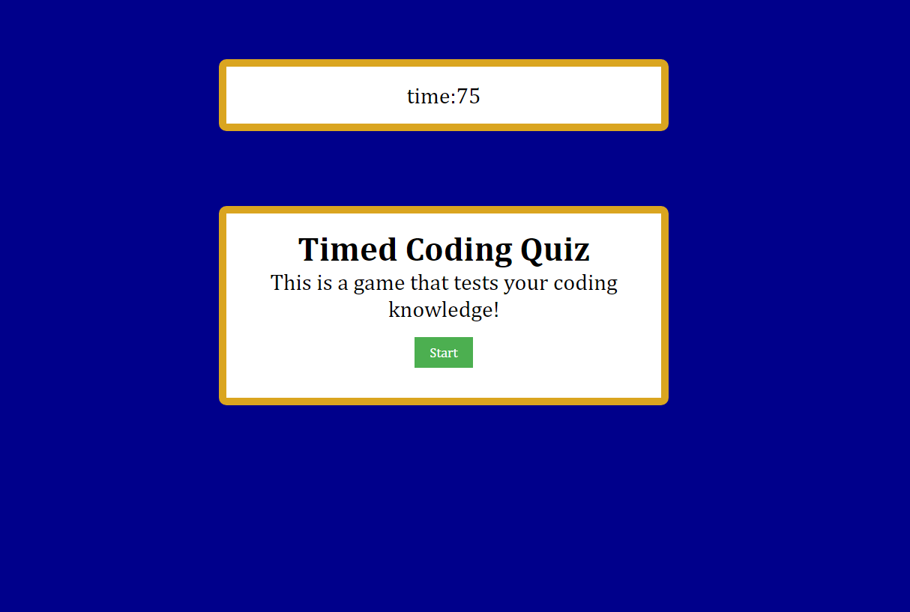

# *module-4-challenge* (Timed Quiz)

## **Description**

This project is a demonstration of a timed quiz that utilizes javascript to ask multiple questions and give a score with a timer attached. This work shows my current progress with timers, if/else statements, and localStorage concepts. 

## **Installation**

https://jakelipscomb.github.io/timed-quiz/



## **Technologies**
Project is created with:
* Visual Studio Code version: 1.78.2
	
## **Setup**
To run this project, clone it locally using bash:

```
$ bash
$ git clone https://github.com/jakelipscomb/timed-quiz.git
```

## **Credits**
Coursework provided by The University of Texas at Austin Center for Professional Education Coding Boot Camp

https://www.edx.org/course/the-coding-boot-camp-at-ut-austin#24775ad0-27b4-53da-943a-30a2a394c452

## **License**

MIT License

Copyright (c) 2023 jakelipscomb

Permission is hereby granted, free of charge, to any person obtaining a copy
of this software and associated documentation files (the "Software"), to deal
in the Software without restriction, including without limitation the rights
to use, copy, modify, merge, publish, distribute, sublicense, and/or sell
copies of the Software, and to permit persons to whom the Software is
furnished to do so, subject to the following conditions:

The above copyright notice and this permission notice shall be included in all
copies or substantial portions of the Software.

THE SOFTWARE IS PROVIDED "AS IS", WITHOUT WARRANTY OF ANY KIND, EXPRESS OR
IMPLIED, INCLUDING BUT NOT LIMITED TO THE WARRANTIES OF MERCHANTABILITY,
FITNESS FOR A PARTICULAR PURPOSE AND NONINFRINGEMENT. IN NO EVENT SHALL THE
AUTHORS OR COPYRIGHT HOLDERS BE LIABLE FOR ANY CLAIM, DAMAGES OR OTHER
LIABILITY, WHETHER IN AN ACTION OF CONTRACT, TORT OR OTHERWISE, ARISING FROM,
OUT OF OR IN CONNECTION WITH THE SOFTWARE OR THE USE OR OTHER DEALINGS IN THE
SOFTWARE.

---